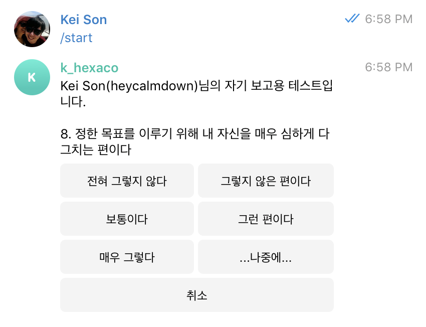

# HEXACO

책 `H 팩터의 심리학` 중 단축형 HEXACO 성격 검사지 

* Telegram 지원
* 1:1 대화와 그룹 대화 둘 다 가능
* 질문이 많아서 쉬어가면서 할 수 있음(S3에 저장)

# Example

* 텔레그램에서 HEXACO(@HexacoBot) 친구 추가
* `/start`

# Todos

* [x] AWS Lambda support
* [ ] Racket support
* [ ] Crystal support
* [ ] Go support
